```mermaid
stateDiagram-v2
    state "Sample-sboms" as SampleSboms
    state "sbom-json-viewer" as SbomJsonViewer
    state "AGENTS.md" as AgentsMd
    state "Goal.md" as GoalMd
    state "Architecture.md" as ArchitectureMd
    state "IMPLEMENTATION_SUMMARY.md" as ImplementationSummaryMd
    state "simpleghome.cyclonedx.json" as SimpleGhomeSbom
    state "components.json" as ComponentsJson
    state "eslint.config.js" as EslintConfig
    state "package.json" as PackageJson
    state "README.md" as ReadmeMd
    state "DashboardView.tsx" as DashboardViewTsx
    state "ComponentExplorer.tsx" as ComponentExplorerTsx
    state "DependencyTree.tsx" as DependencyTreeTsx
    state "DependencyGraph.tsx" as DependencyGraphTsx
    state "sbomSizing.ts" as SbomSizingTs
    state "ViewContext.tsx" as ViewContextTsx
    state "LayoutContext.tsx" as LayoutContextTsx
    state "Sidebar.tsx" as SidebarTsx
    state "Layout.tsx" as LayoutTsx
    state "useMediaQuery.ts" as UseMediaQueryTs
    state "sbomWorker.ts" as SbomWorkerTs
    state "ReverseDependencyTree.tsx" as ReverseDependencyTreeTsx
    state "dependencyUtils.ts" as DependencyUtilsTs
    state "SettingsContext.tsx" as SettingsContextTsx
    state "VexContext.tsx" as VexContextTsx
    state "SearchButton.tsx" as SearchButtonTsx
    state "VulnerabilitiesView.tsx" as VulnerabilitiesViewTsx
    state "SupplyChainRiskView.tsx" as SupplyChainRiskViewTsx
    state "Accordion.tsx" as AccordionTsx
    state "SbomSelector.tsx" as SbomSelectorTsx
    state "ticketExportUtils.ts" as TicketExportUtilsTs
    state "exportUtils.ts" as ExportUtilsTs
    state "vulnerabilityCardTemplate.ts" as VulnerabilityCardTemplateTs
    state "VulnerabilityLink.tsx" as VulnerabilityLinkTsx
    state "ComponentDetailPanel.tsx" as ComponentDetailPanelTsx

    [*] --> SampleSboms
    [*] --> SbomJsonViewer
    [*] --> AgentsMd
    [*] --> GoalMd
    [*] --> ArchitectureMd
    [*] --> ImplementationSummaryMd

    SampleSboms --> SimpleGhomeSbom

    SbomJsonViewer --> public
    SbomJsonViewer --> src
    SbomJsonViewer --> ComponentsJson
    SbomJsonViewer --> EslintConfig
    SbomJsonViewer --> PackageJson
    SbomJsonViewer --> ReadmeMd
    SbomJsonViewer --> RootSbom
    SbomJsonViewer --> TestingChecklistMd
    SbomJsonViewer --> UserGuideMd
    SbomJsonViewer --> TsConfigJson
    SbomJsonViewer --> TsConfigAppJson
    SbomJsonViewer --> TsConfigNodeJson
    SbomJsonViewer --> ViteConfigTs
    SbomJsonViewer --> VitestConfigTs
    SbomJsonViewer --> PlaywrightConfigTs
    SbomJsonViewer --> TestsFolder

    public --> SampleSimpleSbom
    public --> HugeSbomJson

    src --> AppTsx
    src --> MainTsx
    src --> components
    src --> context
    src --> renderer
    src --> lib
    src --> hooks
    src --> workers
    src --> test
    src --> IndexCss
    src --> assets

    workers --> SbomWorkerTs
    context --> ViewContextTsx
    context --> SettingsContextTsx
    context --> VexContextTsx
    context --> LayoutContextTsx

    lib --> BomConverterTs
    lib --> UtilsTs
    lib --> MermaidLib
    lib --> SbomSizingTs
    lib --> DependencyUtilsTs
    lib --> TicketExportUtilsTs
    lib --> ExportUtilsTs
    lib --> VulnerabilityCardTemplateTs

    hooks --> UseSbomStatsTs
    hooks --> UseSbomLoaderTs
    hooks --> UseMediaQueryTs

    MermaidLib --> SbomToMermaidTs
    MermaidLib --> SbomToMermaidTestTs

    components --> layout
    components --> views
    components --> ui
    components --> common

    common --> ErrorBoundaryTsx
    common --> HelpTooltipTsx
    common --> HelpGuideTsx
    common --> SearchButtonTsx
    common --> SbomSelectorTsx
    common --> VulnerabilityLinkTsx
    common --> ProcessingLogTsx

    layout --> LayoutTsx
    layout --> SidebarTsx

    views --> DashboardViewTsx
    views --> ComponentExplorerTsx
    views --> DependencyTreeTsx
    views --> DependencyGraphTsx
    views --> ReverseDependencyTreeTsx
    views --> VulnerabilitiesViewTsx
    views --> SupplyChainRiskViewTsx
    views --> ComponentDetailPanelTsx

    ui --> CardTsx
    ui --> ButtonTsx
    ui --> BadgeTsx
    ui --> AccordionTsx
    ui --> Other_UI_Components

    renderer --> RendererTsx
    renderer --> Formatter
    renderer --> SBOMComponent

    Formatter --> FormatterTsx
    Formatter --> Statistics

    Statistics --> UniqueLicensesTsx
    Statistics --> UniqueVulnerabilitiesTsx

    SBOMComponent --> SbomComponentTsx
    SBOMComponent --> SbomComponentTestTsx

    test --> MockDataTs
    test --> SetupTs
    test --> PrivacyIsolationTestTs
    test --> performance
    performance --> FormatterBenchTs
    performance --> PerformanceSpecTs

    TestsFolder --> E2ETestsFolder
    E2ETestsFolder --> SbomViewerE2ETestTs
    E2ETestsFolder --> PerformanceSpecTs
```

## Component Descriptions

### App.tsx

Main application component that:

- Orchestrates the UI layout and view switching.
- **Delegates SBOM loading and state management to `useSbomLoader`**.
- Wraps application in `ViewProvider` and `SettingsProvider`.
- Renders `Layout` shell.
- Lazy-loads view modules to keep initial bundle small.
- **NEW**: Displays a **Remote Source** indicator when data is fetched from external URLs.

### useSbomLoader.ts (Hook)

Encapsulates the core logic for:

- **Worker Communication**: Spawns and manages `sbomWorker.ts` interactions.
- **State Management**: Holds `sbom`, `formattedSbom`, `stats`, and loading states.
- **Routing**: Handles URL hash changes to load specific SBOMs from `manifest.json`.
- **Error Handling**: Manages error states and retries.
- **NEW**: Captures and exposes **Processing Logs** from the Web Worker for user transparency.

### sbomWorker.ts

Web Worker responsible for:

- Synchronous JSON parsing of large files.
- Converting raw JSON to the application's internal BOM model.
- Computing statistical summaries (license counts, vulnerability aggregates).
- Formatting the nested component structure for tree rendering.
- All results are returned as plain objects for optimal serialization.
- **NEW**: Generates granular **Processing Logs** (e.g., "Deduplicated X components") to provide auditability of the local processing steps.

### Views

- **DashboardView.tsx**: Displays high-level statistics, KPI cards (including **digitally signed SBOM detection** and **Metadata Health scoring**), and charts using pre-computed stats. Includes deep links to Developer Insights.
- **ComponentExplorer.tsx**: A feature-rich table for searching, filtering, and inspecting components details.
- **DependencyTree.tsx**: A hierarchical view implemented with **UI Virtualization (`react-virtuoso`)** for infinite-scale tree exploration.
- **DependencyGraph.tsx**: Visualizes relationships using Mermaid.js with interactive depth control. **NEW**: Displays a **Truncation Warning** badge when the graph is limited by depth or node limits.
- **ReverseDependencyTree.tsx**: Shows "who depends on this" impact analysis with usage-based ranking.
- **VulnerabilitiesView.tsx**: Provides a comprehensive catalog of security findings with deep spec support for CycloneDX 1.7. Includes **Data Source Transparency** notices and **External Link Disclosure** warnings.
  - **NEW**: **Live VEX Assessment** panel allows users to locally override vulnerability status (e.g., to "Not Affected") with justification.
  - **NEW**: **VEX-Enriched CycloneDX export** allows downloading a JSON SBOM with local assessments injected as properties and analysis states.
  - **NEW**: **Muted Filtering** allows users to toggle visibility of vulnerabilities they've assessed as non-risky.
- **SupplyChainRiskView.tsx**: **NEW**: Analyzes component risk by combining security findings (vulnerability score), impact (blast radius), and license compliance. Features a Risk Exposure Matrix (scatter plot) and a risk-ranked leaderboard.
- **MultiSbomStatsView.tsx**: Visualizes overlap and deduplication metrics when merging multiple SBOMs. 
  - **NEW**: **Source Efficacy Ranking** provides a weighted score (Metadata, Breadth, Depth) to identify the "Best" SBOM from multiple uploads.
  - **NEW**: **Discovery Gap Analysis (Blind Spots)** highlights components and vulnerabilities that were only found by a single scanner, helping audit tool coverage.
  - Includes a "How Merging Works" section detailing PURL-based deduplication and vulnerability reconciliation.
- **ComponentDetailPanel.tsx**: A persistent sidebar component that provides deep inspection of a single component.
  - Displays identity (Name, Version, Type, PURL, BOM Ref).
  - Surface's security findings (Inherent and Transitive vulnerabilities).
  - Visualizes license categories and reveals extended properties.
  - **New:** Displays cryptographic hashes (MD5, SHA-256) for file integrity verification.
  - Integrates `SearchButton` for quick external lookups.
  - **Accordion-based Layout**: Organizes detailed information into collapsible sections (Overview, Technical Details, Remediation, Affected Components, Metadata) using `@radix-ui/react-accordion`.
  - Features include: Detailed timeline (created, published, modified), remediation (recommendations, workarounds), credits, tools, unique CVE analysis (state, justification), and interactive ratings (CVSS method, vector strings).
  - **Visual Statistics**: Displays Top CWEs and Top Sources alongside the severity breakdown.
  - **Interactive Filtering**: Includes clickable severity KPI cards and a multi-select filter dropdown for both component and vulnerability views.
  - Component-centric view: Maps vulnerabilities back to components with specific status tracking (affected vs. not_affected).
  - Individual sections are protected by granular `ErrorBoundary` instances to ensure one bad data field doesn't crash the entire panel.

### Context & Hooks

- **ViewContext.tsx**: Manages the active view state (Dashboard, Components, Tree, Graph).
- **SettingsContext.tsx**: Manages global application settings, such as default search engine preferences, with persistence via `localStorage`.
- **VexContext.tsx**: **NEW**: Manages local **Vulnerability Exploitability eXchange (VEX)** assessments. Tracks status (Not Affected, Affected, Under Investigation) and justifications for individual findings, persisting them in `localStorage`.
- **LayoutContext.tsx**: **NEW**: Coordinates the responsive shell state, including sidebar toggle and mobile-mode detection.
- **useMediaQuery.ts**: **NEW**: Low-level hook for reacting to screen size changes.
- **useSbomStats.ts**: Fallback logic for calculating stats if not provided by the worker (mostly for small/legacy inputs).

### Layout

- **Layout.tsx**: Main shell structure. Includes **Privacy-First Notices** for local processing. **NEW**: Automatically adapts to mobile by providing a drawer-based sidebar and rendering detail panels as full-screen overlays instead of side panels.
- **Header.tsx**: **NEW**: A condensed top navigation bar focusing on the active page title, global search, download actions, and help. Redistributed SBOM selection and upload to the Sidebar to reduce clutter and improve mobile usability.
- **Sidebar.tsx**: Navigation menu for switching between views. **NEW**: Now houses the **SBOM Selector** and **Upload SBOM** controls at the bottom, separating data management from page navigation. Supports collapsible mode on desktop and full-width drawer mode on mobile. Includes keyboard shortcuts (Alt+1-9).

### Common Components

- **ErrorBoundary.tsx**: A reusable error boundary that isolates failures in specific UI sections (charts, tables, details). Supports custom fallbacks and dependency-based resets (`resetKeys`).
- **HelpGuide.tsx**: User documentation accessible via the header. Includes **Privacy & Security assurances** detailing local-first data handling.
- **HelpTooltip.tsx**: Reusable tooltip for in-app documentation.
- **SearchButton.tsx**: Reusable search component with customizable engine selection and persistence.
- **SbomSelector.tsx**: A combobox-based SBOM selector with grouping support.
- **VulnerabilityLink.tsx**: Centralized component for linking vulnerability IDs (CWE, CVE, GHSA) to their respective official databases. **NEW**: Includes a **Privacy Disclosure** tooltip warning that clicking links shares the ID with external providers.
- **ProcessingLog.tsx**: **NEW**: A terminal-style dialog that displays the background steps taken by the Web Worker, ensuring users can verify the tool's local-first behavior.

### Utilities

- **bomConverter.ts**: Converts raw JSON to typed `Bom` objects (optimized $O(N)$ lookup). **NEW**: Implements a **Parsing Warning** system to capture and report malformed JSON structures without crashing.
- **Formatter.tsx**: Pre-processes the BOM to build optimized nested structures (optimized vulnerability indexing).
- **sbomToMermaid.ts**: Generates Mermaid syntax for graphs. **NEW**: Reports **Truncation State** when graph limits are reached.
- **sbomSizing.ts**: Centralizes large-SBOM heuristics.
- **dependencyUtils.ts**: Logic for inverting dependency graphs and calculating reachability.
- **ticketExportUtils.ts**: Handles CSV generation for ticket systems (Jira, GitLab, GitHub) with platform-specific headers and formatting. Supports browser-side downloads.
- **exportUtils.ts**: Orchestrates PDF and PNG generation of vulnerability cards using an isolated iframe pattern to bypass CSS compatibility issues (`html2canvas` vs `oklch`).
- **vulnerabilityCardTemplate.ts**: Generates a clean, print-optimized HTML template of a vulnerability card using safe hex colors for reliable capture.
- **cloneUtils.ts**: Utilities for deep cloning objects with cycle handling.
- **bomUtils.ts**: Helper functions for traversing and analyzing SBOM structures.
- **run-tests.mjs**: **NEW**: A custom sequential test runner designed for resource-constrained environments (like AI agents). It streams output in real-time, reduces timeouts, and implements a fail-fast policy to provide immediate feedback on the first failure.

## Data Flow

1. **Load**: `useSbomLoader` triggers load (via URL or file import).
2. **Worker**: `useSbomLoader` spawns `sbomWorker.ts`.
3. **Dispatch**: Worker sends a `complete` message with the finalized data and **Processing Logs**.
4. **State**: `useSbomLoader` updates local state with `Bom`, `formattedSbom`, `stats`, and **Logs**.
5. **Render**: `App.tsx` passes this state to Views.
   - _Dashboard_: Uses `stats` directly.
   - _Explorer_: Uses raw `Bom` components.
   - _Tree_: Uses `formattedSbom` with virtualization.
   - _Graph_: Uses `formattedSbom` -> `sbomToMermaid`.

## Testing

- **Unit**: Vitest for logic (hooks, converters, formatters).
- **Privacy**: **NEW**: `PrivacyIsolation.test.ts` programmatically proves zero network calls are made during local processing.
- **E2E**: Playwright for user flows and **Performance Stress Testing** (20k component load).

## Publishing and Manifest Generation

The application uses `publish.sh` to handle building and deploying the static site to AWS S3 and CloudFront.

During the publishing process:

1. `npm run build` generates the production bundle into `dist/`.
2. The script locally executes SBOM generators to create "Self Scans" in `dist/sboms/self/` and copies them to `public/sboms/self/`.
3. `generate-manifest.mjs` dynamically reads the `dist/sboms/` and `public/sboms/` directories to generate `manifest.json`. This acts as the source of truth for the `useSbomLoader` to populate the `SbomSelector` without requiring a backend.
